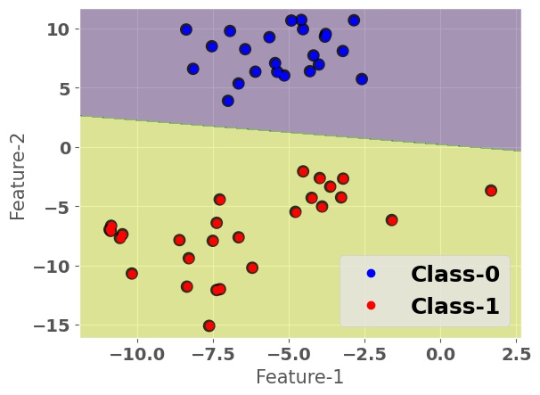
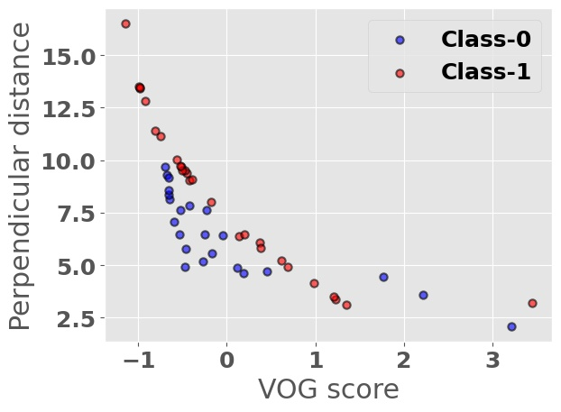
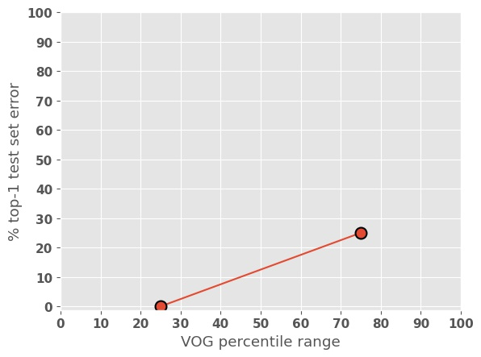
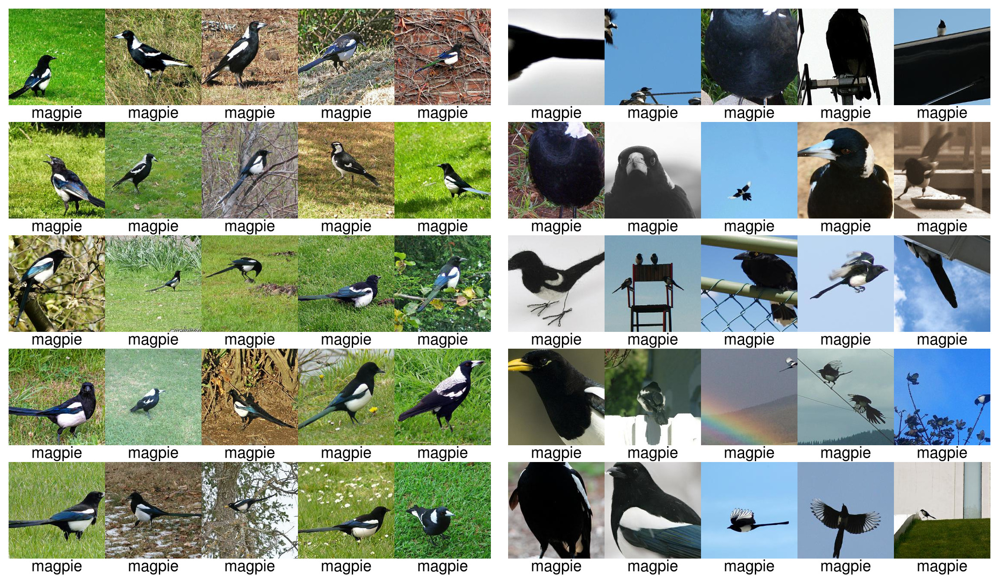
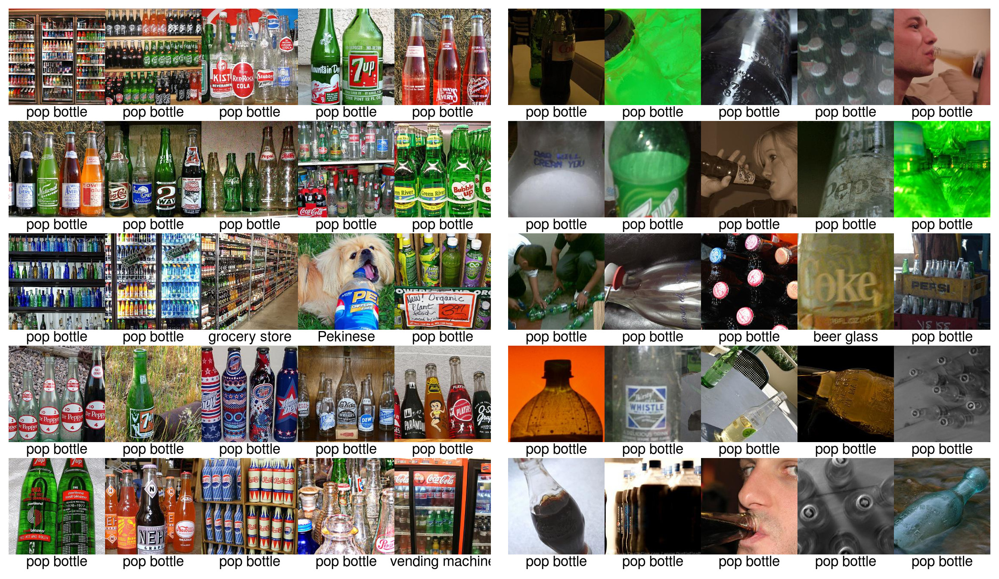

## Estimating Example Difficulty using Variance of Gradients

This repository contains source code necessary to reproduce some of the main results in [the paper](https://arxiv.org/abs/2008.11600):

**If you use this software, please consider citing:**
    
    @article{agarwal2020estimating, 
    title={Estimating Example Difficulty using Variance of Gradients},
    author={Agarwal, Chirag and Hooker, Sara},
    journal={arXiv preprint arXiv:2008.11600},
    year={2020}
    }
    
## 1. Setup

### Installing software
This repository is built using a combination of TensorFlow and PyTorch. You can install the necessary libraries by pip installing the requirements text file `pip install -r ./requirements_pytorch.txt` & `pip install -r ./requirements_tf.txt`

## 2. Usage
### Toy experiment
[toy_script.py](toy_script.py) is the script for running toy dataset experiment. You can analyze the training/testing data at diffferent stages of the training, viz. Early, Middle, and Late, using the flags `split` and `mode`. The `vog_cal` flag enables visualizing different versions of VOG scores such as the raw score, class normalized, or the absolute class normalized scores. 

#### Examples
Running `python3 toy_script.py --split test --mode early --vog_cal normalize` generates the toy dataset decision boundary figure along with the relation between the perpendicular distance of individual points from the decision boundary and the VOG scores. The respective figures are:

    
    

<i>Left: The visualization of the toy dataset decision boundary with the testing data points. The Multiple Layer Perceptron model achieves 100% training accuracy. Right: The scatter plot between the Variance of Gradients (VoGs) for each testing data point and their perpendicular distance shows that higher scores pertain to the most
challenging examples (closest to the decision boundary)</i>

### ImageNet
The main scripts for the ImageNet experiments are in the `./imagenet/` folder. 

1. Before calculating the VOG scores you would need to store the gradients of the respective images in the `./scripts/train.txt/` file using model snapshots. For demonstration purpose, we have shared the model weights of the [late stage](https://drive.google.com/drive/folders/1_dY4H_dizvTGUkQFAQANfFRDc_82Bsli?usp=sharing), i.e. steps 30024, 31275, and 32000. Now, for example, we want to store the gradients for the imagenet dataset (stored as <path>/imagenet_dir/train) at snapshot `32000`, we run the shell script [train_get_gradients.sh](train_get_gradients.sh) like:
    
`source train_get_gradients.sh 32000 ./imagenet/train_results/ 9 ./scripts/train.txt/`

2. For this repo, we have generated the gradients for 100 random images for the late stage training process and stored the results in `./imagenet/train_results/`. To generate the error rate performance at different VOG deciles run [train_visualize_grad.py](train_visualize_grad.py) using the following command.
`python train_visualize_grad.py`

    

On analyzing the VOG score for a particular class (e.g. below are `magpie` and `pop bottle`) in the late training stage, we found two unique groups of images.
In this work, we hypothesize that examples that a model has difficulty learning (images on the right) will exhibit higher variance in gradient updates over the course of training (. On the
other hand, the gradient updates for the relatively easier examples are expected to stabilize early in training and converge to a narrow range of values.

&nbsp; &nbsp; &nbsp; &nbsp; &nbsp; &nbsp; &nbsp; &nbsp; &nbsp; &nbsp; &nbsp; &nbsp; &nbsp; &nbsp; &nbsp; &nbsp; &nbsp; &nbsp; &nbsp; &nbsp; &nbsp; &nbsp; &nbsp; &nbsp; &nbsp; &nbsp; &nbsp; &nbsp; &nbsp; **Lowest VOG** &nbsp; &nbsp; &nbsp; &nbsp; &nbsp; &nbsp; &nbsp; &nbsp; &nbsp; &nbsp; &nbsp; &nbsp; &nbsp; &nbsp; &nbsp; &nbsp; &nbsp; &nbsp; &nbsp; &nbsp; &nbsp; &nbsp; &nbsp; &nbsp; &nbsp; &nbsp; &nbsp; &nbsp; &nbsp; &nbsp; **Highest VOG**

    

    

<i>Each 5×5 grid shows the top-25 ImageNet training-set images with the lowest and highest VOG scores for the class magpie and pop bottle with their predicted labels below the image. Training set images with higher VOG scores (b) tend to feature zoomed-in images with atypical color schemes and vantage points.</i>

## 4. Licenses
Note that the code in this repository is licensed under MIT License, but, the pre-trained condition models used by the code have their own licenses. Please carefully check them before use. 

## 5. Questions?
If you have questions/suggestions, please feel free to [email](mailto:chiragagarwall12@gmail.com) or create github issues.
